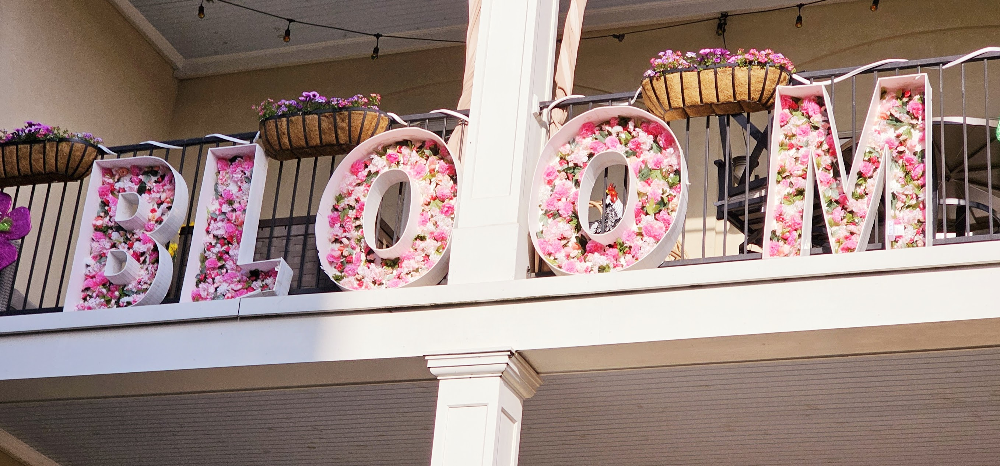

My wife and I spend a lot of time together. We're not attached at the hip or anything, but we're really close, we get along, and we have plenty of things in common. Maybe it's cliche, but we really are best friends. So it's going to be weird when she leaves early tomorrow morning to go to San Francisco for a family reunion for a few days. Not only will I miss her a lot, but I'll be single-parenting for a few days. I always appreciate my wife and everything she does, but I really appreciate her when she's gone for a few days and realize just how much she really does for this family.

Anyway, I'll be keeping myself busy with work and parenting, and I might go see the Civil War movie on Wednesday since it's something she's not interested in seeing. Oh and this evening we're going to look at a car for the 16-year-old daughters. Then this weekend is the Apple Blossom Festival here in town.

