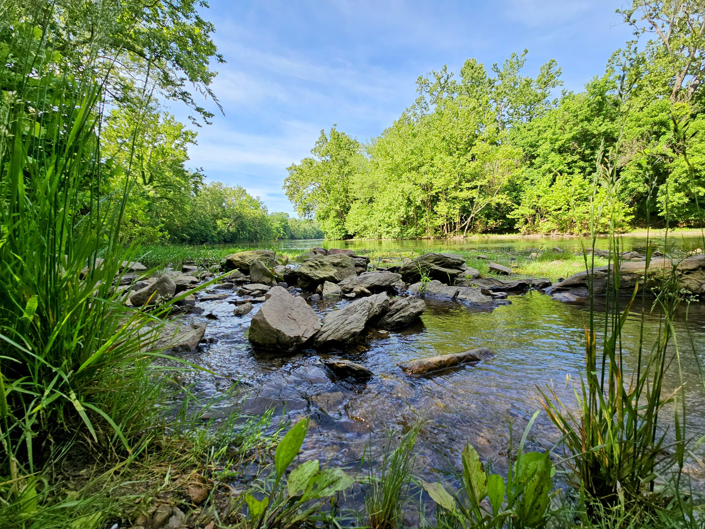
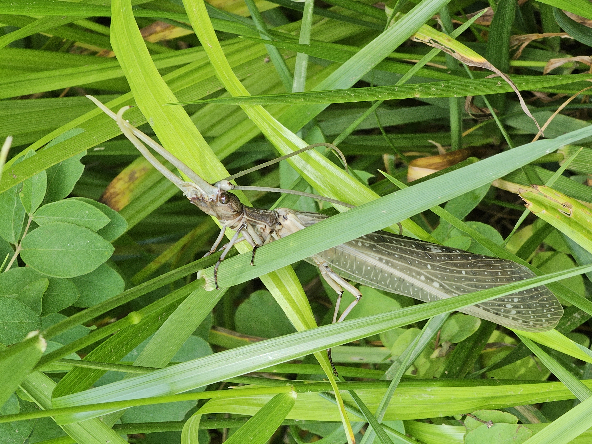

This morning we managed to get 2/3 of the children up and out the door at 9am for a hike. One of the teenagers decided she would rather sleep in.

The trail is a nice, mostly paved loop at the Shenandoah University agricultural center at Cool Springs Battlefield. You can continue on to a wooded trail at about halfway through the loop, which takes you to a small waterfall in the creek. We used to be able to go up above the waterfall, but they now have this blocked off. Still, it's really nice to just be in the woods next to a waterfall. After that we headed back down the other side of the loop and back to the car to head home for lunch.

