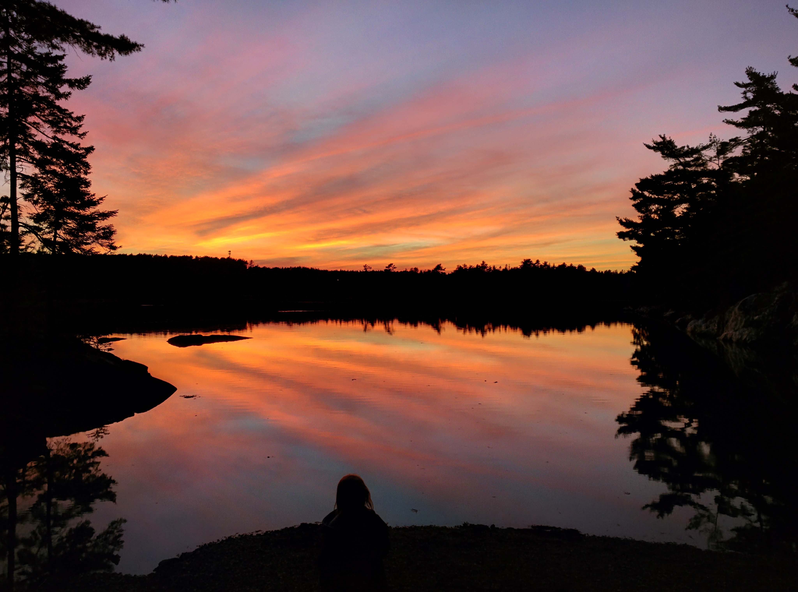
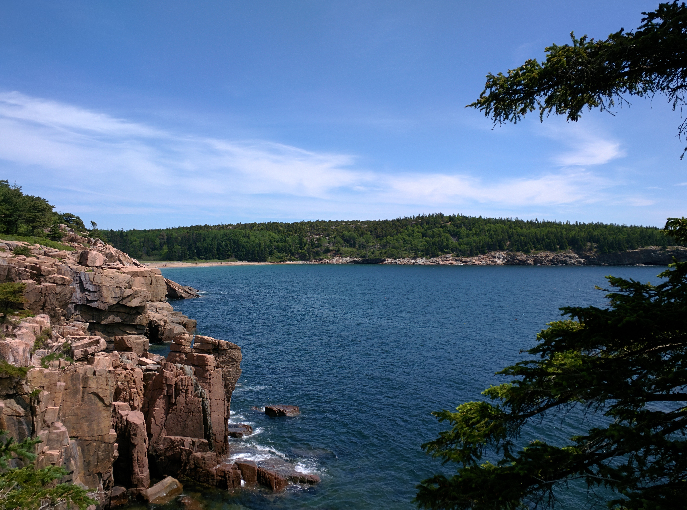
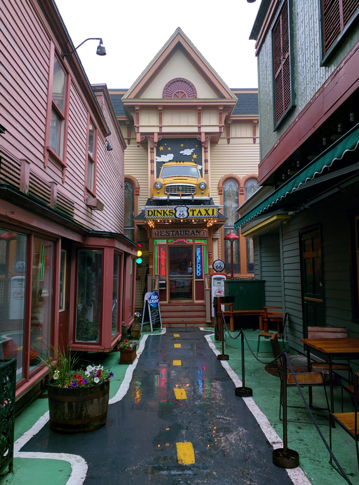
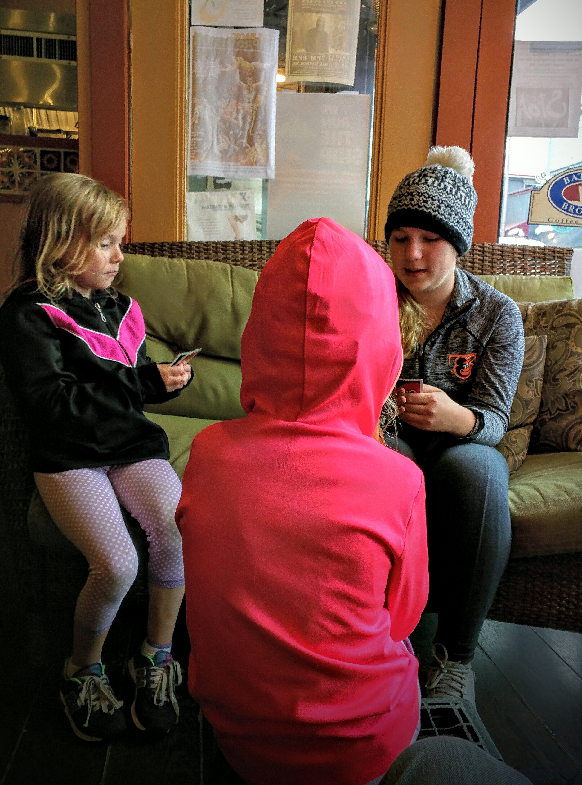
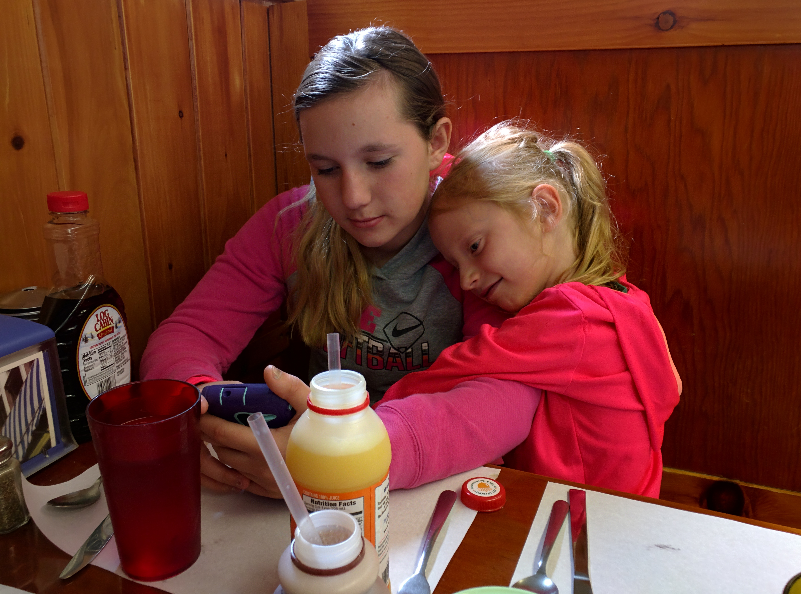
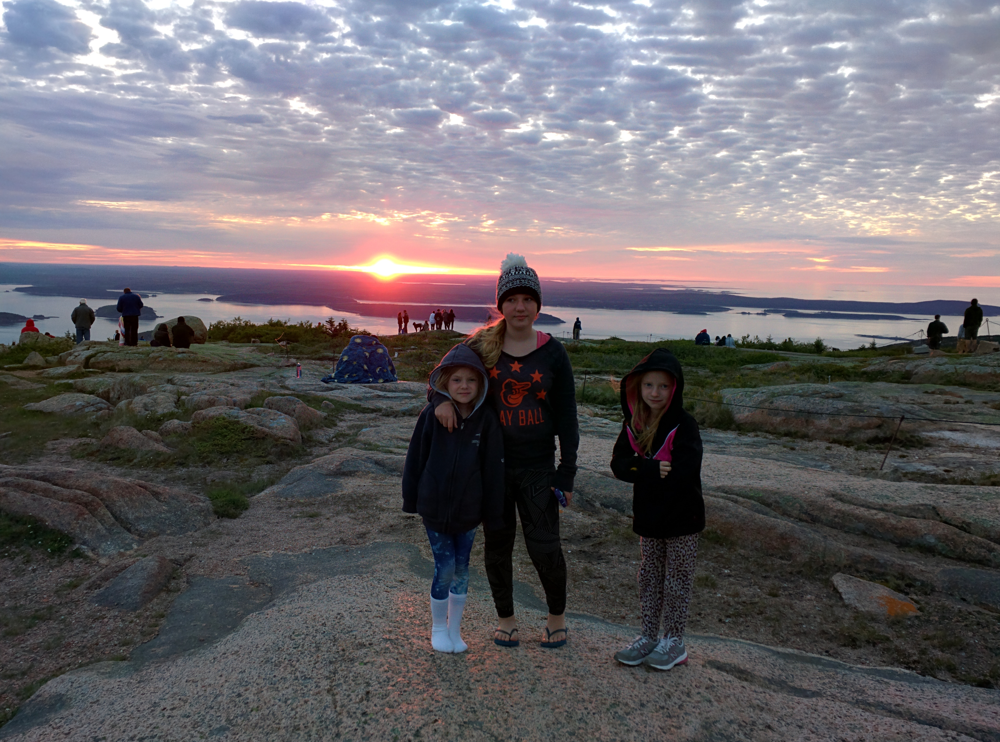
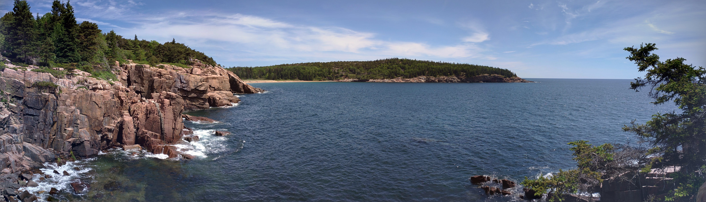
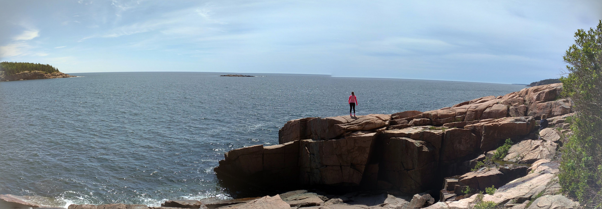

2015 was quite a year for me for a number of reasons. At that point in my life I had been separated from my ex-wife for about 3 years. That whole experience was a bit traumatic for me. It took me a long time to heal and move on physically, emotionally, and mentally. One major motivator for me was a trip to Maine in June of 2015.

I kind of decided on a whim that I wanted to go to Maine, and I wanted to take the three girls with me (the oldest was 12 and the twins were 7 then). To me this was a big step in proving to myself that I was going to be OK on my own, and that I could be a great single father. It was also something that I thought the kids needed after having dealt with their parents being separated. So with only about a week's notice, I made reservations at a campground outside of Acadia National Park. The following week, I packed up the car with our tent and everything we would need to camp for a few days. Around 3:00 AM on a Sunday I carried the kids from their beds to the car, and we were on our way.

They continued sleeping in the car until we hit NYC. They had never been to NYC so they were in awe of the skyline as we came up I-95 and crossed the George Washington Bridge. I don't remember the exact route we took but I remember being scared we were going to die in Massachusetts. I thought people in Virginia drove aggressively. Wow. I also forgot how huge the state of Maine is. We reached the Maine border and still had about 5.5 hours to go to reach Acadia National Park. Anyway, after a few bathroom breaks and food breaks, we reached our destination around 7:30 PM. 15.5 hours in the car, with three (thankfully) very patient little girls. It was quite the journey, but it was worth it.


    
    


Over the next several days, we explored the town of Bar Harbor, its cute shops, and delicious restaurants. We visited a couple of the lighthouses around Mt. Desert Island. We spent some time at a laundromat drying our blankets and sleeping bags, after our tent leaked during a torrential downpour. Mostly, though, we spent our time exploring Acadia National Park. I haven't been a lot of places, but that is one of the most beautiful places I've ever been. I think that statement would hold true no matter how many places I had been to. It was breathtaking. We visited many of the highlights of the park: the seaside cliffs, the clear blue lakes, the pristine beaches, and the challenging but rewarding hikes. Some of my favorite memories are of watching the girls run around and explore freely.


    
    
    
    
    
    
    
    


That trip was iconic for my kids and I. I feel like it was a turning point to a new chapter not only in my life, but theirs as well. It helped me realize that I was going to be OK, and I also think it helped the kids to see that I was going to be just fine. The timing couldn't have been better, because later that year I met the woman who is now my wife. My second chance. I don't know that I would have been in a good emotional and mental state to meet someone new had I not taken that trip to Maine. I needed that perspective, that view of a world outside of the one my mind had been stuck in for so long.

Now my wife and I are planning a trip back there next year, with all four of our girls. It's sort of poetic in a way, I think. Like I want to go back there and thank that place for helping me heal, and bring with me the results of that journey.

